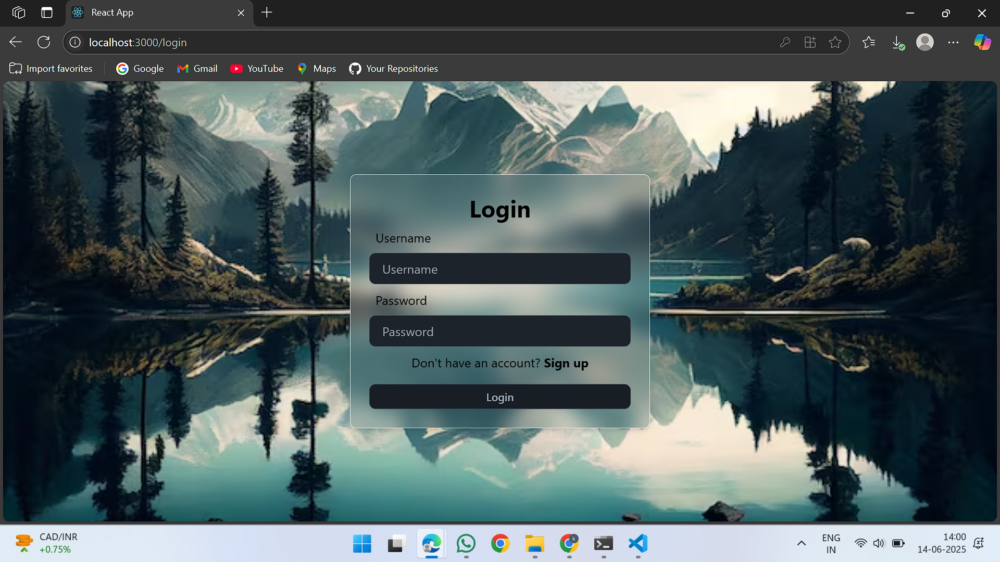
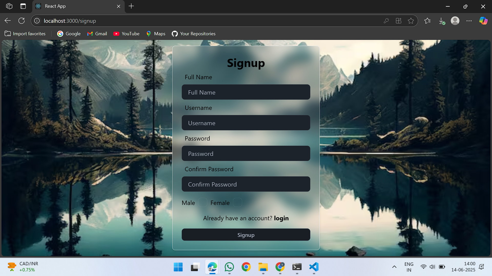
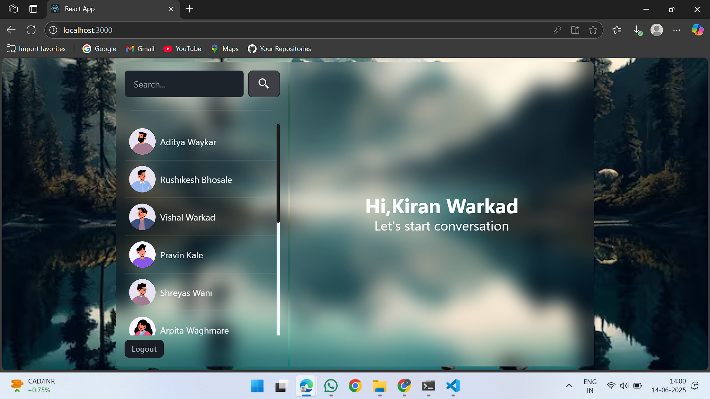
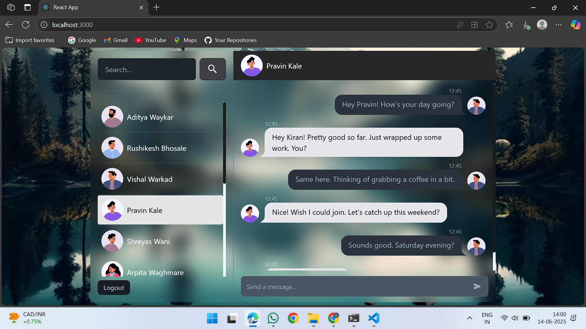
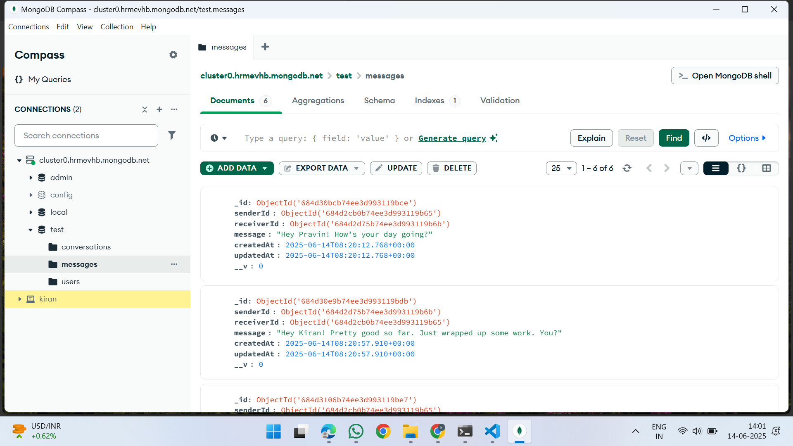
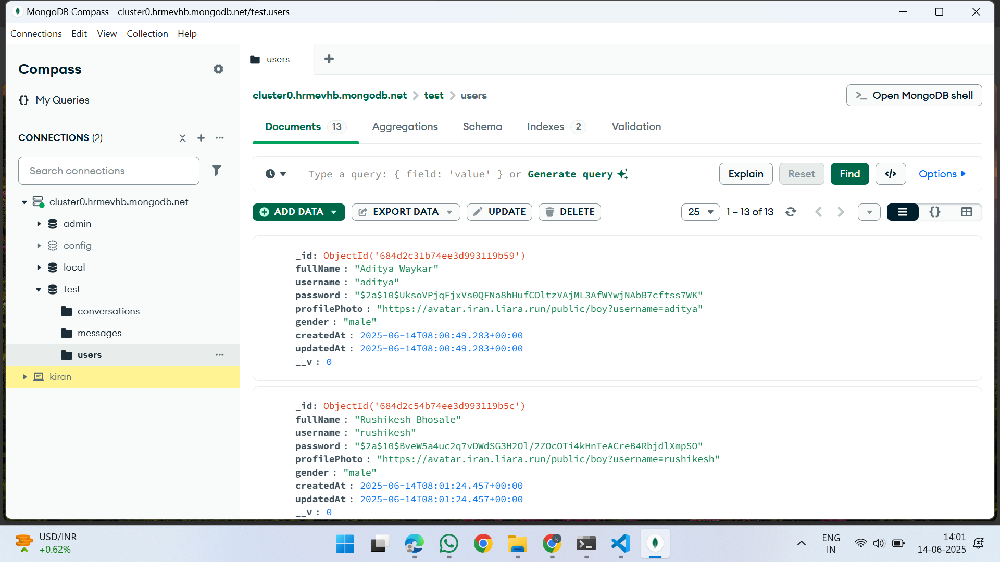

# 💬 Chat Application

A full-stack real-time chat application with user authentication, one-on-one messaging, and persistent conversations using **MERN Stack** (MongoDB, Express.js, React, Node.js).

## 📸 Screenshots

### 🧾 Login Page

### 📝 Signup Page

### 🏠 Dashboard

### 💬 Chat Interface

### 🗃️ MongoDB - Messages Collection

### 👥 MongoDB - Users Collection

---

## 🚀 Features

- 🔐 User authentication (login & signup)
- 👤 Real-time one-on-one messaging
- 📡 Socket.io integration for live chat updates
- 💾 Persistent messages stored in MongoDB
- 💡 Modern React UI with Redux state management

---

## 🛠️ Tech Stack

| Technology     | Role                     |
|----------------|--------------------------|
| React.js       | Frontend framework        |
| Redux          | State management          |
| Node.js        | Backend runtime           |
| Express.js     | Server framework          |
| MongoDB        | Database                  |
| Socket.IO      | Real-time communication   |
| bcrypt, JWT    | Authentication & Security |
| Tailwind CSS / CSS | Styling                |

---

## 🧑‍💻 Run Locally

✅ Clone the Repository

git clone https://github.com/kiranwarkad1/Chat-Application.git
cd Chat-Application
⚙️ Setup Backend
bash
Copy
Edit
cd backend
npm install
npm run dev

📝 Create a .env file inside the backend/ folder and add:
PORT=5000
MONGO_URI=your_mongo_connection_string
JWT_SECRET=your_jwt_secret
Your backend will now be running at:
👉 http://localhost:5000

🌐 Setup Frontend
cd ../frontend
npm install
npm start
Your frontend is now live at:
👉 http://localhost:3000

📁 Folder Structure
Chat-Application/
├── backend/
│   ├── controllers/
│   ├── models/
│   ├── routes/
│   ├── server.js
│   └── ...
├── frontend/
│   ├── src/
│   ├── public/
│   ├── App.js
│   └── ...
└── README.md

📬 Contact
Kiran Warkad
📧 Email: kiranwarkad1@gmail.com
🔗 LinkedIn: linkedin.com/in/kiran-warkad
🔗 GitHub: github.com/kiranwarkad1

